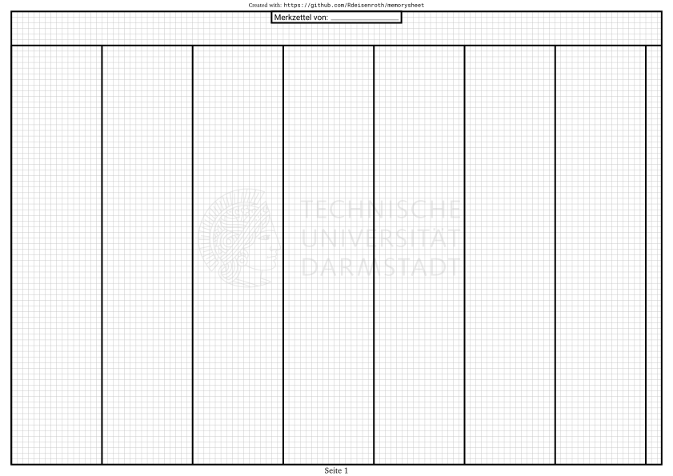

# LaTeX memory Sheet
A template for creating memory sheet permitted in exams with customizable grids (for me i wanted 0.25cm grids)

You might want to turn off page numbers or the credits, if your printer doesn't support borderless printing.

Here is a preview of the template, with watermark, page numbers and credits turned on:

